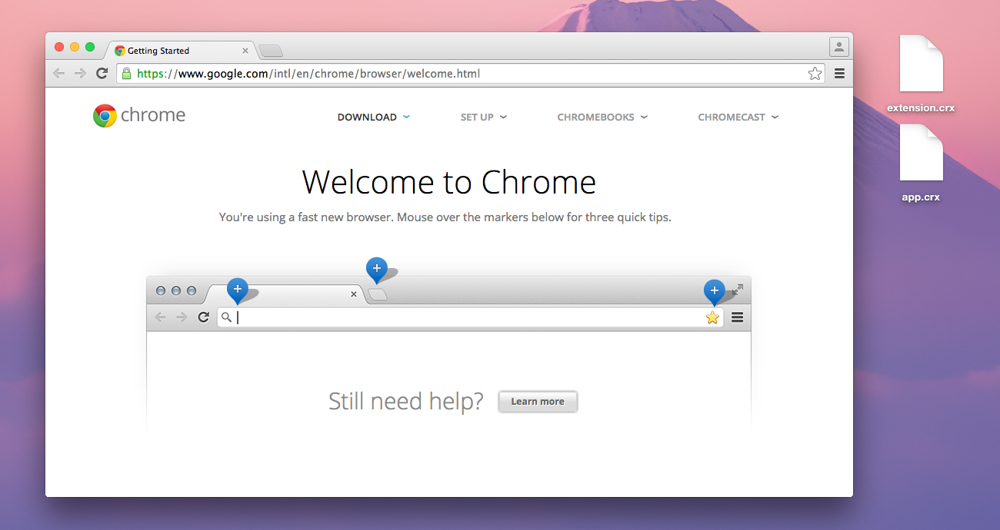
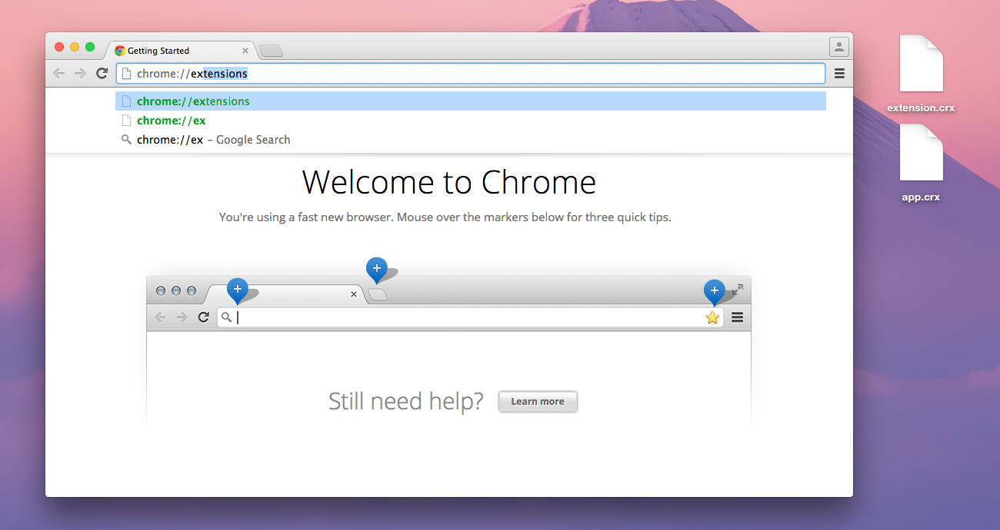
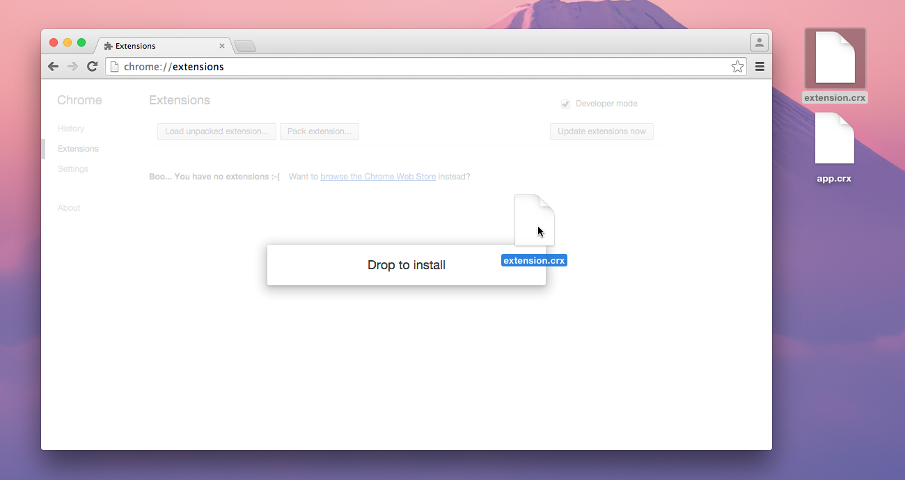
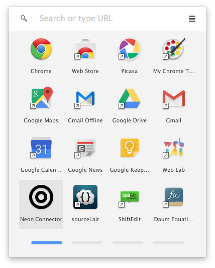
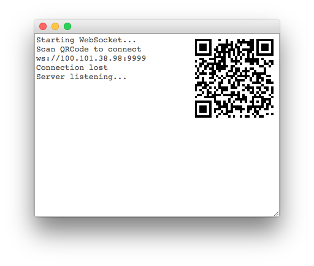
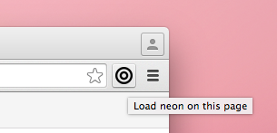

# neon
用手机简易遥控浏览器（某课程作业）。

你需要一个 Chrome 浏览器。

## 安装

（拖拽）安装两个插件。

（稍后开源。如果你并不信任，可在沙盒用户下安装，并启用隐私窗口）

## 使用

- 保证你的手机与电脑在同一局域网内；
- 打开 Chrome App 中的「Neon Connector」，正常情况下会显示出一张二维码：

- 使用手机扫码进入控制器页面；
- 在任意网页（比如这儿）点击插件栏中的 Neon 图标，网页中央会显示出十字准星：

- 将手机对准准心，按下「OK」，即可操控本网页

推荐玩一玩 [Space Lamb](http://spacelamb.12wave.com/) 或 [Fruit Ninja](http://ucren.com/demos/fruit-ninja/)。

## 源码

完善中。
